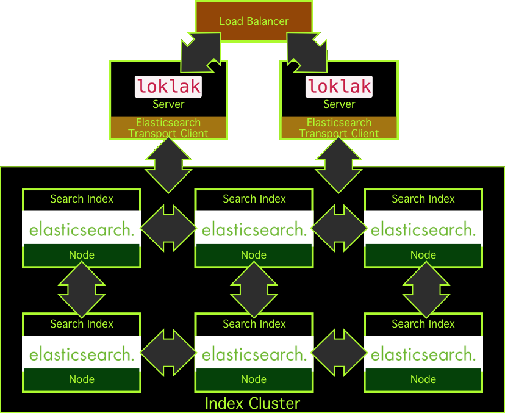

# The `loklak` Architecture

loklak is a java application which runs a jetty web server for the html interface and an Elasticsearch search server. The application contains a self-documentation which consists of the web pages you are looking at right now. There is also a [javadoc](javadoc.html).

- [File System Structure](#the-file-system-structure)
- [Application Sockets and Ports](#application-sockets-and-ports)
- [Search Process and Communication to the Back-End](#search-process-and-communication-to-the-back-end)
- [Large-Scale Search](#large-scale-search-topology)
- [Loklak Network Topology](#loklak-network-topology)
- [Data Format Of Message Dumps](#what-is-the-data-format-of-message-dumps)
- [User Accounts and Access Restrictions](#user-accounts-and-access-restrictions)

## The File System Structure

The file structure follows a default java application folder naming:


```ruby
+-- loklak
   +-- bin
       +-- start.sh
       +-- stop.sh
   +-- build.xml 
   +-- classes 
   +-- classes 
   +-- conf
        +-- config.properties
   +-- data
       +-- dump
           +-- import
           +-- imported
           +-- own
       +-- index 
       +-- settings
           +-- customized_config.properties
   +-- html
   +-- lib
   +-- LICENSE.txt
   +-- messages.log
   +-- README.txt 
   +-- src
```

| Directory | Description |
| --- | --- |
| bin | directory: start and stop scripts |
| start.sh | file: run this script to start loklak |
| stop.sh | file: run this script to stop loklak |
| build.xml | file: ant build file |
| classes | directory: java binary class files |
| conf |   directory: initial configuration data
| config.properties |   file     : the initial configuration properties (dont change that)
| data |   directory: all data produced by the application
| dump  |   directory: place for message dump file folders
| import  |   directory: to import a dump, throw the dump in here, it will got to...
| imported |   directory: processed dump files from the import folder are moved here
| own |   directory: dump files which this application creates, accessible at /dump/
| index |   directory: the Elasticsearch shard folder
| settings |   directory: application settings storage
| customized_config.properties |   file     : app settings, overwrites conf/config.properties.
| html |   directory: the loklak web pages including this page you are looking at
| lib  |   directory: linked libraries for loklak
| LICENSE.txt |   file     : the LGPL license
| messages.log |   file     : application output is streamed in here
| README.txt |   file     : you should read this if you are using loklak the first time
| src |   directory: java sources

## Application Sockets and Ports

There is only one public port available, port 9000. `loklak` opens two more ports for Elasticsearch, port 9200 (Elasticsearch HTML api) and 9300 (Elasticsearch Transport API) but they are configured to be unavailable for clients from non-localhost sockets. You can change the port numbers and access rules in conf/config.properties. If you want to run several `loklak` instances on the same host, you must change three port number (i.e. by increasing all by one).

## Search Process and Communication to the Back-End

Search results are combined from the internal Elasticsearch index and external sources such as Twitter. To retrieve the Twitter search results, a web page scraper is used to circumvent the forced OAuth identification of the search users. The search process has three phases:

### Dispatching the Search Request

This happens when the search.json api is called: the api servlet concurrently queries a Twitter scraper and the internal Elasticsearch index:

As a part of this process, the Twitter scraper also  de-shortens( all links embedded in all Tweets from the search result.
### Merging the Search Results

The search result is merged into one message list. Merging is easily done because all messages have an identifier and the messages are simply ordered by their date:

As part of the merge process, all new, previously unknown messages can be identified. These are pushed on a storage list for future processing.

### Distribution of Messages

An independent caretaker-process runs every three seconds and looks how many new messages had been placed on the storage queue; if the number exceedes a given limit (i.e. 100) then all messages are stored to the own file system and pushed over the back-end API to the back-end peer.

Files pushed on the latest message file stack can be downloaded immediately. The same happens at the back-end peer: new messages appear immediately there as well.

## Large-Scale Search Topology

To scale the build-in search to an unlimited index size within a single loklak node, loklak uses the scaling methods as provided by elasticsearch. While loklak comes by default with a deeply embedded elasticsearch node, it is also possible to replace this node with an elasticsearch transport client. This client then may connect to an external elasticsearch node, which can also be a node of a large elasticsearch cluster.

If the loklak search index is hosted outside of loklak, it is also possible to connect several loklak server to the same elasticsearch cluster. To provide high-availability, it is possible to use several loklak servers for one front-end at the same time using a load-balancer.

## Loklak Network Topology

The topology of the `loklak` depends only on you: using the back-end configuration, you can chain peers and data from scraped content flows along the network chain until it reaches a back-end, which has no other back-end.

### Organic Growth

If you install loklak, you may keep the assigned back-end peer (see config.properties: backend property), or assign another one. If you tell people about `loklak`, tell them to assign your peer as backend. Your peer will get all Tweets from those new peers, and it will dispatch them also to your back-end.

### Delegate Scraping

If your peer cannot access Twitter.com or you dont want to load Tweets yourself, you can assign a front-peer to do that for your (see config.properties: frontpeers). You can also assign several peers (which will be used round-robin) and even peers which have no back-end themself (maybe your own swarm of scrapers).


## What is The Data Format Of Message Dumps

The message dumps mentioned above are lists of JSON terms. loklak creates a new dump file for every month, but only if loklak is (re-)started. The dump file gets appended with a JSON term whenever a new message appears and is indexed. That means that the dump file itself is not JSON because there is missing a list bracket at the start and the end and commas in between. Every line in the file is an individual JSON term which makes it possible to grep over the file. Whenever a new file is opened, the old one is gzipped automatically.

A dump file looks like (these are four lines):

```{"created_at":"2015-03-06T19:47:05.000Z","screen_name":"KohlerSolutions","text":"There will be a very interesting #Mozilla track at #FOSSASIA in Singapore: http://fossasia.org/track/FOSSASIA-Mozilla.pdf","link":"https://twitter.com/KohlerSolutions/status/573932833573568512","id_str":"573932833573568512","source_type":"TWITTER","provider_type":"SCRAPED","retweet_count":3,"favourites_count":2,"user":{"name":"Michael Kohler","screen_name":"KohlerSolutions","profile_image_url_https":"https://pbs.twimg.com/profile_images/554282692489924608/wPVGA62a_bigger.jpeg","appearance_first":"2015-03-07T11:00:45.798Z","appearance_latest":"2015-03-07T11:00:45.798Z"}}
{"created_at":"2015-03-07T05:51:10.000Z","screen_name":"bytebot","text":"Will you be @fossasia ? I9m excited to give a keynote about @mariadb there! http://fossasia.org/","link":"https://twitter.com/bytebot/status/574084855664783361","id_str":"574084855664783361","source_type":"TWITTER","provider_type":"SCRAPED","retweet_count":1,"favourites_count":1,"user":{"name":"Colin Charles","screen_name":"bytebot","profile_image_url_https":"https://pbs.twimg.com/profile_images/490878058648178688/TtpjnwOx_bigger.jpeg","appearance_first":"2015-03-07T11:02:07.754Z","appearance_latest":"2015-03-07T11:02:07.754Z"}}
{"created_at":"2015-03-07T05:49:11.000Z","screen_name":"utianayuba","text":"di @fossasia akan bicara @tuanpembual dari @GLiBogor, @syaimif dari @BlankOnLinux, @emily_chen dari @gnome_asia.","link":"https://twitter.com/utianayuba/status/574084356295159808","id_str":"574084356295159808","source_type":"TWITTER","provider_type":"SCRAPED","retweet_count":3,"favourites_count":1,"user":{"name":"Utian Ayuba","screen_name":"utianayuba","profile_image_url_https":"https://pbs.twimg.com/profile_images/538635188478029825/RtgStA6W_bigger.jpeg","appearance_first":"2015-03-07T11:02:07.758Z","appearance_latest":"2015-03-07T11:02:07.758Z"}}
{"created_at":"2015-03-07T03:31:47.000Z","screen_name":"comprock","text":"I9ve been presenting and working with http://fossasia.org/","link":"https://twitter.com/comprock/status/574049779975655424","id_str":"574049779975655424","source_type":"TWITTER","provider_type":"SCRAPED","retweet_count":1,"favourites_count":0,"user":{"name":"Michael Cannon","screen_name":"comprock","profile_image_url_https":"https://pbs.twimg.com/profile_images/574054683079090176/3-XSsyEh_bigger.jpeg","appearance_first":"2015-03-07T11:02:07.842Z","appearance_latest":"2015-03-07T11:02:07.842Z"}}```

These dump files can easily filtered with standard shell script tools - like grep - to produce new input dump files to be imported in new/different loklak instances.


## User Accounts and Access Restrictions

There are no user accounts in `loklak` and you cannot configure some. There is an exception with the embedded Elasticsearch instance, please refer to the documentation of that library.

Access restrictions are done by distinguishing accesses frow localhost and from other hosts. While requests to servlets from localhost clients do not have any restrictions, external client accesses may have restrictions. Restricted are i.e. a large depth number for the crawl start and excessive requests to the html interface.

